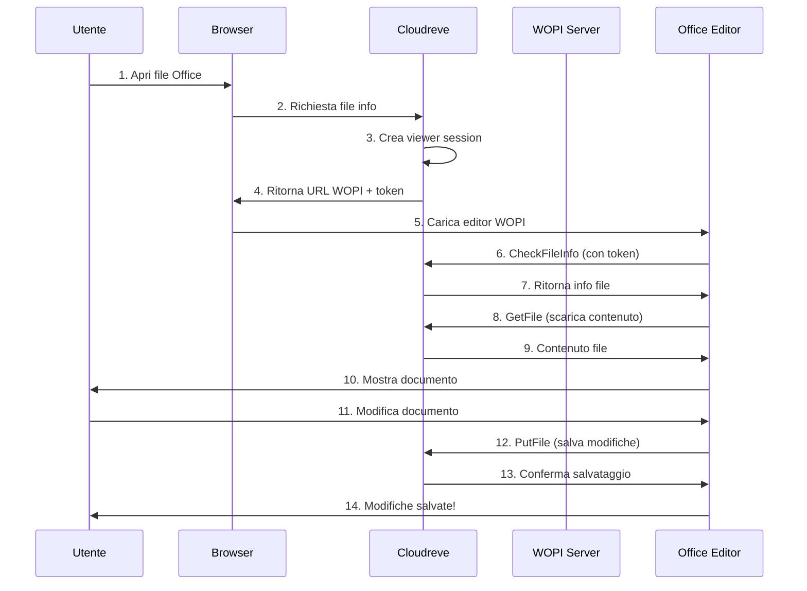

# Guida Visuale - Setup WOPI per Cloudreve

Questa guida visuale ti mostra passo-passo come abilitare l'editing online di documenti Office in Cloudreve.

## 📋 Panoramica

```
┌─────────────────────────────────────────────────────────────┐
│                    CLOUDREVE + WOPI                         │
│                                                             │
│  Browser → Cloudreve → WOPI Server → Office Editor         │
│           (File Mgmt)  (Collabora)    (Online)             │
└─────────────────────────────────────────────────────────────┘
```

## 🎯 Setup in 3 Passi (10 minuti)

### Passo 1️⃣: Installa Server WOPI

```ascii
┌──────────────────────────────────────────────┐
│  $ docker run -t -d -p 9980:9980 \           │
│    -e "aliasgroup1=https://tuo-dom.com" \    │
│    --name collabora \                        │
│    collabora/code                            │
├──────────────────────────────────────────────┤
│  ✓ Collabora avviato su porta 9980          │
└──────────────────────────────────────────────┘
```

**Verifica:**
```bash
$ curl -I http://localhost:9980/hosting/discovery
HTTP/1.1 200 OK
Content-Type: text/xml
```

### Passo 2️⃣: Configura in Cloudreve

```ascii
┌──────────────────────────────────────────────┐
│  1. Accedi come Admin                        │
│     ↓                                        │
│  2. Dashboard Admin → Strumenti → WOPI      │
│     ↓                                        │
│  3. Inserisci endpoint:                      │
│     http://localhost:9980/hosting/discovery  │
│     ↓                                        │
│  4. Clicca "Recupera"                        │
│     ↓                                        │
│  5. Abilita visualizzatori                   │
├──────────────────────────────────────────────┤
│  ✓ WOPI configurato!                         │
└──────────────────────────────────────────────┘
```

### Passo 3️⃣: Testa

```ascii
┌──────────────────────────────────────────────┐
│  1. Carica un file .docx                     │
│     ↓                                        │
│  2. Clicca sul file                          │
│     ↓                                        │
│  3. Si apre l'editor online!                 │
│     ┌────────────────────────────┐           │
│     │ 📄 Document.docx           │           │
│     ├────────────────────────────┤           │
│     │  [B] [I] [U]  Font ▼       │           │
│     ├────────────────────────────┤           │
│     │                            │           │
│     │  Hello World!              │           │
│     │  _                         │           │
│     │                            │           │
│     └────────────────────────────┘           │
└──────────────────────────────────────────────┘
```

## 🔄 Flusso di Lavoro Completo



## 🏗️ Architettura del Sistema

```ascii
┌─────────────────────────────────────────────────────────────┐
│                         BROWSER                             │
│  ┌───────────────────┐        ┌──────────────────┐          │
│  │  Cloudreve UI     │        │  WOPI Editor     │          │
│  │  (File Manager)   │        │  (Office Online) │          │
│  └────────┬──────────┘        └────────┬─────────┘          │
└───────────┼──────────────────────────┼─────────────────────┘
            │                          │
            │ HTTPS                    │ WOPI Protocol
            │                          │
┌───────────▼──────────────────────────▼─────────────────────┐
│                      CLOUDREVE SERVER                       │
│  ┌─────────────────────────────────────────────────────┐   │
│  │  Router                                             │   │
│  │  ┌──────────────┐  ┌──────────────┐               │   │
│  │  │ File API     │  │ WOPI API     │               │   │
│  │  │ /api/v4/file │  │ /api/v4/file │               │   │
│  │  │              │  │ /wopi/:id    │               │   │
│  │  └──────┬───────┘  └──────┬───────┘               │   │
│  └─────────┼──────────────────┼─────────────────────────┘   │
│            │                  │                             │
│  ┌─────────▼──────────────────▼─────────────────────────┐   │
│  │  Controller Layer                                    │   │
│  │  - FileController                                    │   │
│  │  - WopiController (CheckFileInfo, GetFile, PutFile) │   │
│  └─────────┬──────────────────────────────────────────┘   │
│            │                                               │
│  ┌─────────▼──────────────────────────────────────────┐   │
│  │  Service Layer                                      │   │
│  │  - WopiService                                      │   │
│  │  - ViewerSessionManager                             │   │
│  │  - LockManager                                      │   │
│  └─────────┬──────────────────────────────────────────┘   │
│            │                                               │
│  ┌─────────▼──────────────────────────────────────────┐   │
│  │  File Manager                                       │   │
│  │  - Local Storage                                    │   │
│  │  - Remote Storage (S3, OneDrive, etc.)            │   │
│  └────────────────────────────────────────────────────┘   │
└─────────────────────────────────────────────────────────────┘
                          │ WOPI Discovery
                          │
┌─────────────────────────▼───────────────────────────────────┐
│                    WOPI SERVER                              │
│                  (Collabora Online)                         │
│  ┌───────────────────────────────────────────────────────┐  │
│  │  Discovery Endpoint                                   │  │
│  │  /hosting/discovery → XML con app supportate         │  │
│  └───────────────────────────────────────────────────────┘  │
│  ┌───────────────────────────────────────────────────────┐  │
│  │  LibreOffice Core                                     │  │
│  │  - Writer (documenti)                                 │  │
│  │  - Calc (fogli di calcolo)                           │  │
│  │  - Impress (presentazioni)                           │  │
│  └───────────────────────────────────────────────────────┘  │
└─────────────────────────────────────────────────────────────┘
```

## 🔐 Sistema di Lock

```ascii
Scenario: Due utenti editano lo stesso file

Utente A                    Cloudreve              Utente B
   │                           │                       │
   │ 1. Apri doc.docx          │                       │
   ├──────────────────────────►│                       │
   │                           │                       │
   │ 2. Lock file (30min)      │                       │
   │◄──────────────────────────┤                       │
   │                           │                       │
   │ 3. Editing...             │                       │
   │                           │                       │
   │                           │    4. Apri doc.docx   │
   │                           │◄──────────────────────┤
   │                           │                       │
   │                           │ 5. File bloccato!     │
   │                           ├──────────────────────►│
   │                           │    (409 Conflict)     │
   │                           │                       │
   │ 6. Salva modifiche        │                       │
   ├──────────────────────────►│                       │
   │                           │                       │
   │ 7. Unlock automatico      │                       │
   │◄──────────────────────────┤                       │
   │                           │                       │
   │                           │    8. Ora può aprire  │
   │                           │◄──────────────────────┤
   │                           │                       │
```

## 📁 Formati Supportati

```ascii
┌─────────────────────────────────────────────────┐
│  DOCUMENTI                                      │
│  ┌──────┐ ┌──────┐ ┌──────┐ ┌──────┐           │
│  │.docx │ │ .doc │ │ .odt │ │ .rtf │           │
│  └──────┘ └──────┘ └──────┘ └──────┘           │
├─────────────────────────────────────────────────┤
│  FOGLI DI CALCOLO                               │
│  ┌──────┐ ┌──────┐ ┌──────┐ ┌──────┐           │
│  │.xlsx │ │ .xls │ │ .ods │ │ .csv │           │
│  └──────┘ └──────┘ └──────┘ └──────┘           │
├─────────────────────────────────────────────────┤
│  PRESENTAZIONI                                  │
│  ┌──────┐ ┌──────┐ ┌──────┐                    │
│  │.pptx │ │ .ppt │ │ .odp │                    │
│  └──────┘ └──────┘ └──────┘                    │
└─────────────────────────────────────────────────┘
```

## 🚀 Setup Produzione con Docker

```ascii
┌────────────────────────────────────────────────────────┐
│                    INTERNET                            │
└──────────────────┬─────────────────────────────────────┘
                   │ HTTPS (443)
┌──────────────────▼─────────────────────────────────────┐
│                  NGINX                                 │
│  ┌──────────────────┐  ┌──────────────────┐           │
│  │ files.dom.com    │  │ office.dom.com   │           │
│  │ (SSL Termination)│  │ (SSL Termination)│           │
│  └────────┬─────────┘  └────────┬─────────┘           │
└───────────┼──────────────────────┼─────────────────────┘
            │                      │
            │ HTTP                 │ HTTP + WebSocket
            │                      │
┌───────────▼──────────┐  ┌────────▼─────────────────────┐
│   CLOUDREVE          │  │   COLLABORA ONLINE           │
│   Container          │  │   Container                  │
│   Port 5212          │  │   Port 9980                  │
│                      │  │                              │
│  ┌────────────────┐  │  │  ┌────────────────────────┐  │
│  │ File Storage   │  │  │  │ LibreOffice Core       │  │
│  │ /uploads       │  │  │  │ + WOPI Server          │  │
│  └────────────────┘  │  │  └────────────────────────┘  │
│  ┌────────────────┐  │  │                              │
│  │ Database       │  │  │                              │
│  │ cloudreve.db   │  │  │                              │
│  └────────────────┘  │  │                              │
└──────────────────────┘  └──────────────────────────────┘
```

## 💡 Troubleshooting Visuale

### ❌ Problema: WOPI Discovery Failed

```ascii
Browser → Cloudreve → ❌ → Collabora
          Admin Panel    Connection Failed

Soluzioni:
1. ┌────────────────────────────────┐
   │ Verifica Collabora in running  │
   │ $ docker ps | grep collabora   │
   └────────────────────────────────┘

2. ┌────────────────────────────────┐
   │ Testa endpoint discovery       │
   │ $ curl localhost:9980/...      │
   └────────────────────────────────┘

3. ┌────────────────────────────────┐
   │ Controlla firewall/rete        │
   └────────────────────────────────┘
```

### ❌ Problema: Unable to Load Document

```ascii
Browser → Office Editor → WOPI API → ❌ → File
          Caricamento...              401 Unauthorized

Soluzioni:
1. ┌────────────────────────────────┐
   │ Verifica dominio in allowlist  │
   │ aliasgroup1=tuo-dominio.com    │
   └────────────────────────────────┘

2. ┌────────────────────────────────┐
   │ Controlla token di sessione    │
   │ Viewer session valida?         │
   └────────────────────────────────┘
```

### ❌ Problema: Cannot Save Changes

```ascii
User → Edit → Save → ❌ → Cloudreve
                     409 Conflict

Soluzioni:
1. ┌────────────────────────────────┐
   │ File bloccato da altro utente? │
   │ Attendi o rimuovi lock         │
   └────────────────────────────────┘

2. ┌────────────────────────────────┐
   │ Verifica permessi scrittura    │
   │ User ha diritti sul file?      │
   └────────────────────────────────┘
```

## 📊 Monitoring Dashboard

```ascii
┌─────────────────────────────────────────────────────────┐
│  CLOUDREVE + WOPI MONITORING                            │
├─────────────────────────────────────────────────────────┤
│                                                         │
│  Status:                                                │
│  ┌─────────────────┐  ┌──────────────────┐             │
│  │ Cloudreve   ✅  │  │ Collabora    ✅  │             │
│  │ Running         │  │ Running          │             │
│  │ Port 5212       │  │ Port 9980        │             │
│  └─────────────────┘  └──────────────────┘             │
│                                                         │
│  Sessioni Attive:  5                                    │
│  ████████░░░░░░░░░░ 40%                                │
│                                                         │
│  File Bloccati:    2                                    │
│  - documento.docx (utente: mario)                       │
│  - report.xlsx (utente: giulia)                         │
│                                                         │
│  Ultimi Accessi:                                        │
│  12:30 - mario   - documento.docx (edit)               │
│  12:25 - giulia  - report.xlsx (edit)                  │
│  12:20 - luca    - slides.pptx (view)                  │
│                                                         │
│  Risorse:                                               │
│  CPU:  ████░░░░░░░░  32%                                │
│  RAM:  ████████░░░░  65% (2.6GB / 4GB)                 │
│  Disk: █████████░░░  75% (150GB / 200GB)               │
│                                                         │
└─────────────────────────────────────────────────────────┘
```

## 🎓 Best Practices

```ascii
✅ DA FARE                        ❌ DA EVITARE
┌──────────────────────┐         ┌──────────────────────┐
│ ✓ Usa HTTPS          │         │ ✗ HTTP in produzione │
│ ✓ Backup regolari    │         │ ✗ No backup          │
│ ✓ Aggiorna software  │         │ ✗ Versioni vecchie   │
│ ✓ Monitora risorse   │         │ ✗ No monitoraggio    │
│ ✓ Log strutturati    │         │ ✗ Ignora log         │
│ ✓ Password forti     │         │ ✗ Password deboli    │
│ ✓ Firewall attivo    │         │ ✗ Porte aperte       │
└──────────────────────┘         └──────────────────────┘
```

## 📚 Prossimi Passi

```ascii
1. ┌────────────────────────────────┐
   │ Leggi QUICK_START_IT.md        │
   │ → Setup rapido in 10 minuti    │
   └────────────────────────────────┘
          ↓
2. ┌────────────────────────────────┐
   │ Installa Collabora con Docker  │
   │ → docker run collabora/code    │
   └────────────────────────────────┘
          ↓
3. ┌────────────────────────────────┐
   │ Configura in Cloudreve         │
   │ → Admin → WOPI → Recupera      │
   └────────────────────────────────┘
          ↓
4. ┌────────────────────────────────┐
   │ Testa con un file .docx        │
   │ → Apri → Edit → Salva          │
   └────────────────────────────────┘
          ↓
5. ┌────────────────────────────────┐
   │ Produzione: Setup SSL/Nginx    │
   │ → Vedi EXAMPLES_IT.md          │
   └────────────────────────────────┘
```

## 🆘 Aiuto Rapido

Hai problemi? Segui questo diagramma:

```ascii
                    ┌─────────────┐
                    │  Problema?  │
                    └──────┬──────┘
                           │
           ┌───────────────┼───────────────┐
           │               │               │
     ┌─────▼─────┐   ┌────▼────┐   ┌─────▼─────┐
     │Discovery  │   │Document │   │   Save    │
     │  Failed   │   │  Error  │   │  Failed   │
     └─────┬─────┘   └────┬────┘   └─────┬─────┘
           │              │               │
    ┌──────▼──────┐ ┌────▼────┐   ┌─────▼──────┐
    │Check:       │ │Check:   │   │Check:      │
    │• Container  │ │• Domain │   │• Permessi  │
    │• Network    │ │• Token  │   │• Lock      │
    │• Firewall   │ │• Sess.  │   │• Spazio    │
    └─────────────┘ └─────────┘   └────────────┘
```

## 📞 Supporto

```ascii
┌─────────────────────────────────────────────┐
│  Serve aiuto?                               │
├─────────────────────────────────────────────┤
│  📖 Documentazione:                         │
│     → docs/WOPI_SETUP_IT.md                 │
│     → docs/EXAMPLES_IT.md                   │
│                                             │
│  💬 Community:                              │
│     → Telegram: t.me/cloudreve_official     │
│     → Discord: discord.gg/WTpMFpZT76        │
│                                             │
│  🐛 Bug/Problemi:                           │
│     → github.com/cloudreve/issues           │
└─────────────────────────────────────────────┘
```

---

**Ricorda:** Il supporto WOPI è già implementato in Cloudreve! 
Serve solo configurare un server WOPI esterno (come Collabora Online). 🚀
